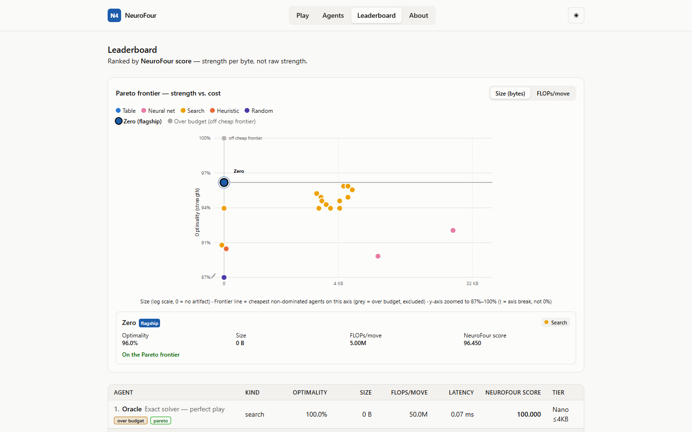
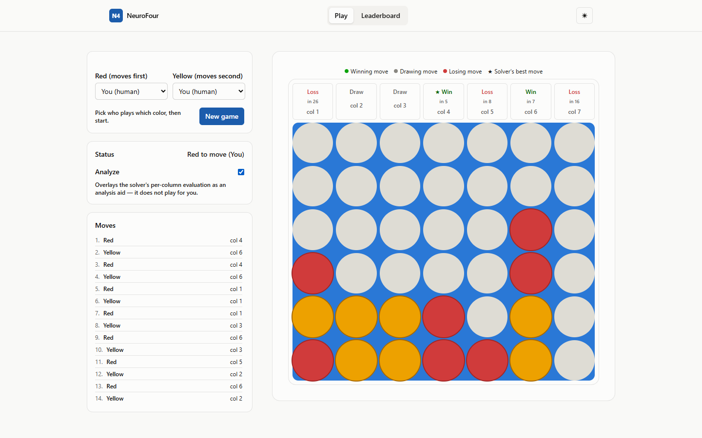
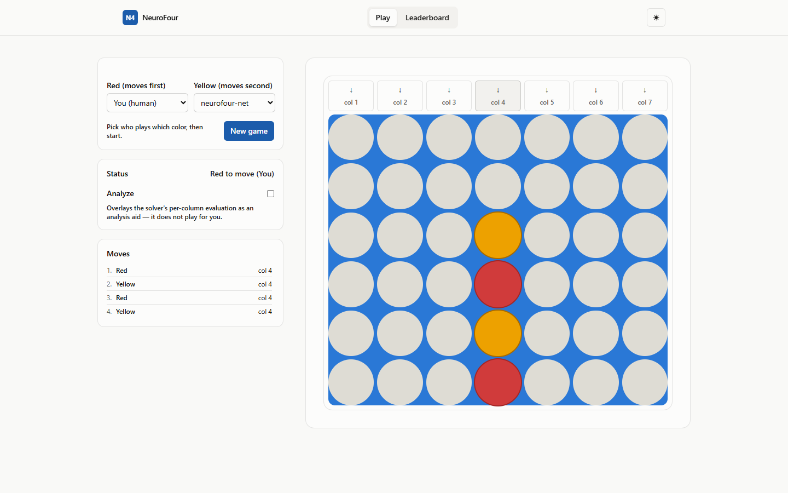
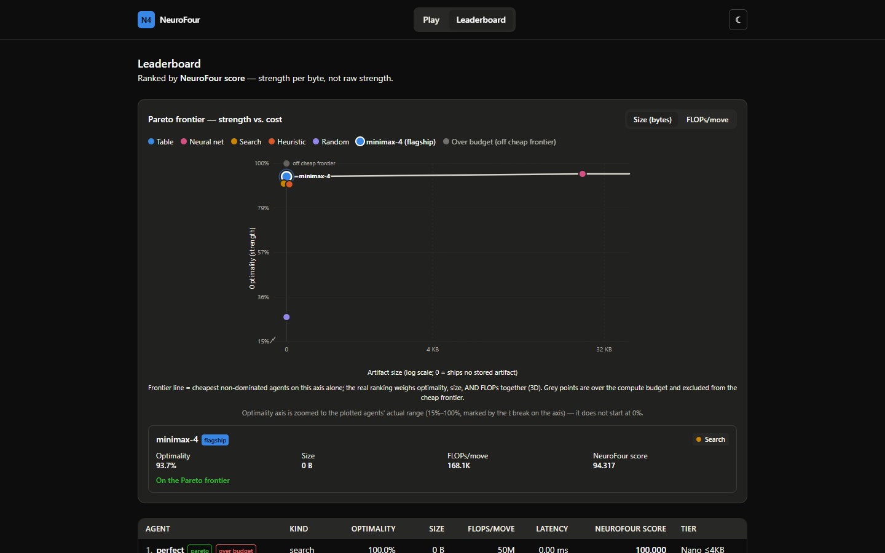

<div align="center">

# NeuroFour

**A Connect 4 arena where agents are ranked by _strength per byte_, not raw strength.**

Play a solved game against 20 benchmarked agents, watch an exact solver narrate every move, and explore the strength-vs-cost Pareto frontier — where the current champion is an agent that ships **zero bytes of weights**.

[](https://github.com/ethan-haas/neurofour/actions/workflows/ci.yml)
[](LICENSE)


<!-- LIVE-DEMO -->
### 🔗 **[Play it live → neurofour.pages.dev](https://neurofour.pages.dev)**

<sub>Frontend on Cloudflare Pages · API on Render ([`/health`](https://neurofour-api.onrender.com/health)) · the free-tier backend sleeps when idle, so the first request may take ~30–60s to wake</sub>
<!-- /LIVE-DEMO -->



</div>

---

## The one result worth your attention

Connect 4 is a **solved game** — perfect play is known. So a perfect agent scores 1.000 optimality. But NeuroFour doesn't rank on strength alone; it ranks on the **NeuroFour Score**, which rewards being strong *for how little you cost* (bytes, FLOPs, latency) under a hard **5M-FLOP-per-move compute budget**.

Under that budget, the leaderboard champion is **`neurofour-net14` — a 0-byte, 0-parameter agent.** No neural network. It's pure bitboard alpha-beta search with a hand-derived heuristic leaf, and at **0.960 optimality it beats every trained network in the arena** (the best learned net, `net16s`, manages 0.950 at 2,867 bytes).

| Rank | Agent | Optimality | Size | FLOPs/move | NeuroFour Score | What it is |
|-----:|-------|-----------:|-----:|-----------:|----------------:|------------|
| — | `perfect` | 1.000 | 0 B | 50.0M | 100.00 | Exact solver — **over the 5M-FLOP budget**, so ineligible for the headline |
| **1** | **`neurofour-net14`** | **0.960** | **0 B** | 5.0M | **96.45** | **Zero-byte bitboard search — the champion** |
| 2 | `minimax-4` | 0.937 | 0 B | 168K | 94.32 | Depth-4 minimax baseline |
| 3 | `neurofour-net16s` | 0.950 | 2,867 B | 3.4M | 74.25 | Best **learned** net (search over a compressed leaf) |
| 4 | `neurofour-net0b` | 0.943 | 3,290 B | 875K | 72.32 | Nano value net |

> **The takeaway:** on a solved game under a tight compute budget, *search beats learned models*, and the most "compressed" strong policy has **no weights at all**. Every neural net ≤32 KB was measured, and none beat zero-byte search. That negative result — rigorously established rather than assumed — is the point of the project.

---

## What you can do in the app

<table>
<tr>
<td width="50%">

**♟️ Play** against any of 20 agents — from `random` up to the perfect solver — on a responsive, keyboard-accessible board.

**🔬 Analyze** any position: an exact Connect 4 solver overlays every legal move with its true game-theoretic value (Win / Draw / Loss) and mate distance. It *abstains* rather than bluffing when a position is too shallow to solve exactly.

**📊 Leaderboard** with an interactive strength-vs-cost **Pareto plot** — toggle the cost axis between artifact size and FLOPs/move, and see exactly which agents are non-dominated.

</td>
<td width="50%">



</td>
</tr>
</table>

<div align="center">


</div>

---

## The NeuroFour Score

The single ranking scalar. Strength, discounted by a slow-growing size penalty:

```
strength        = optimality        # fraction of positions where the agent plays a game-theoretically optimal move
soundness       = 1 - blunder_rate  # how rarely it throws away a won/drawn position
size_kb         = size_bytes / 1024
efficiency_pen  = log2(1 + size_kb) # 0 at 0 KB, grows slowly

NeuroFour Score = 100 * (0.85 * strength + 0.15 * soundness) / (1 + 0.15 * efficiency_pen)
```

A 0-byte agent pays **zero** size penalty, so pure search that matches a small net's strength strictly wins the score. Agents that exceed the 5M-FLOP compute budget are still scored but flagged `over budget` and excluded from the headline — which is why the perfect solver (50M FLOPs) tops the raw table yet doesn't hold the crown.

> NeuroFour is based on the **NeuroGolf** benchmark idea (compress near-optimal play into the fewest bytes), applied to Connect 4. The scoring shown in the UI is NeuroFour's own.

---

## Architecture

```
┌─────────────────────────┐         HTTPS          ┌──────────────────────────────┐
│  Cloudflare Pages        │  ───────────────────►  │  Render (FastAPI + uvicorn)   │
│  React 19 · Vite · TS    │   /leaderboard         │                               │
│  Tailwind · a11y-first   │   /agents  /move       │  app/engine   bitboard rules  │
│                          │   /analyze /health     │  app/solver   exact Connect-4 │
│  Play · Analyze · Board  │  ◄───────────────────  │  app/agents   20 agents + nets│
└─────────────────────────┘        JSON             │  app/neurogolf  scoring/bench │
                                                     └──────────────────────────────┘
```

- **`app/engine`** — bitboard Connect 4 rules; a single canonical `Board.from_moves` so no endpoint can construct an illegal or double-winner board.
- **`app/solver`** — exact solver used by `/analyze` and for offline ground-truth labels.
- **`app/agents`** — the agent zoo: baselines (`random`/`heuristic`/`minimax`/`perfect`) and the `neurofour-net*` family; a registry loads each net's weights only if its artifact is present.
- **`app/neurogolf`** — strength/cost measurement, the ladder Elo, and the NeuroFour Score.
- **`web`** — the React SPA; API base is configured at build time via `VITE_API_BASE`.

---

## Quickstart (local)

**Backend** (Python 3.12+):

```bash
pip install -r requirements.txt
uvicorn app.main:app --reload            # serves on http://localhost:8000
```

**Frontend** (Node 20+):

```bash
cd web
npm ci
npm run dev                              # serves on http://localhost:5173
```

The frontend defaults to `http://localhost:8000` for the API. To point elsewhere, copy `web/.env.example` to `web/.env` and set `VITE_API_BASE`.

**Tests:**

```bash
pytest tests/ -q                         # full suite (the exact-solver test is slow)
make bench                               # regenerate the leaderboard from scratch
```

---

## Deploy your own

This repo is wired for a **static frontend + Python backend** split — exactly how the live demo runs (Cloudflare Pages ➜ Render).

**1. Backend → [Render](https://render.com) (free):** push to GitHub, then in Render pick **New ➜ Blueprint** and connect the repo. [`render.yaml`](render.yaml) provisions a `uvicorn app.main:app` web service with a `/health` check. Copy the resulting URL, e.g. `https://neurofour-api.onrender.com`.

**2. Frontend → [Cloudflare Pages](https://pages.cloudflare.com) (free):** connect the same repo with:

| Setting | Value |
|---|---|
| Root directory | `web` |
| Build command | `npm ci && npm run build` |
| Output directory | `dist` |
| Environment variable | `VITE_API_BASE` = your Render URL |

SPA routing is handled by [`web/public/_redirects`](web/public/_redirects). CORS is already open on the backend, so the two origins talk out of the box.

> Free-tier backends sleep after ~15 min idle; the UI shows a waking state on the first cold request.

---

## Tech stack

**Backend:** Python · FastAPI · Pydantic v2 · NumPy · a from-scratch bitboard engine and exact Connect 4 solver.
**Frontend:** React 19 · TypeScript · Vite · Tailwind CSS · fully keyboard-accessible, light/dark themed, 0 axe-core critical/serious violations at 375 px and 1440 px.
**Quality:** 228 tests (unit + property + flop-honesty + anti-oracle-cheat guards); CI builds the frontend and runs the fast test subset on every push.

## License

[MIT](LICENSE) © 2026 Ethan Haas
